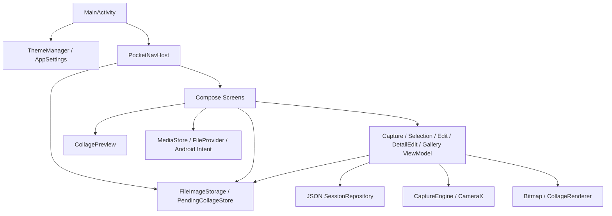
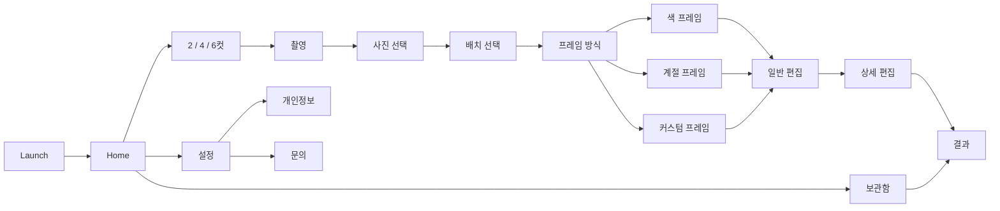

# Pocket 4Cut — 현재 구현과 개발 인수 기준

> 조사일: 2026-09-09 · 기준 HEAD: `95140a0` · **미커밋 변경을 포함한 작업 트리** 기준.
> 실제 코드를 우선해 작성했다. 기존 기획 문서의 완료 표시를 테스트 결과로 간주하지 않는다.
> 이번 작업은 분석·검증·문서화다. 기존 앱 코드와 디자인 변경을 수정하거나 리팩토링하지 않았다.

이 문서는 이후 개발을 시작할 때 읽는 현재 구현 지도다. 파일별 책임은 [CODE_MAP](engineering/CODE_MAP.md), 문제의 근거와 재현 조건은 [KNOWN_ISSUES](engineering/KNOWN_ISSUES.md), 실행한 검증과 남은 테스트는 [VERIFICATION](engineering/VERIFICATION.md)에 있다.

## 1. 프로젝트의 정체와 현재 범위

Pocket 4Cut은 **기기 안에서 촬영·선택·꾸미기·콜라주 생성·보관·공유를 수행하는 Android 포토부스 앱**이다. 단일 Activity, 단일 `:app` Gradle 모듈, Kotlin과 Jetpack Compose UI, CameraX 촬영, Android Bitmap/Canvas 합성을 사용한다.

현재는 개발 준비 단계가 아니다. 전체 핵심 사용자 흐름이 코드에 구현되어 있고 디버그 APK 빌드도 가능하다. 다만 결과 정확성, 상태 복원, 저장 데이터 수명, 접근성 및 테스트에는 아래 문서에 정리한 결함과 공백이 있다. 따라서 “구현됨”, “기기에서 검증됨”, “출시 품질을 충족함”을 구분해야 한다.

| 구분 | 현재 구현 |
|---|---|
| 촬영 구성 | 2컷: 4장 촬영 후 2장 선택 / 4컷: 8장 후 4장 / 6컷: 10장 후 6장 |
| 촬영 기능 | 전·후면, 줌, 매 컷 카운트다운, 카운트다운 생략 수동 셔터, 연속 촬영 |
| 레이아웃 | ID 8개. 실제 기하가 같은 6컷 구성 2개가 포함됨 |
| 프레임 | 색상, 4계절 배경, 사용자 텍스트·이모지·스티커 장식 |
| 일반 편집 | 전체 필터, 배경색, 문구, 날짜, 글꼴·크기·색, 사진 순서 |
| 상세 편집 | 컷별 90도 회전, 좌우 반전, 밝기·대비·채도, 초기화 |
| 결과 | JPEG 생성, 앱 보관함 등록, 공용 사진첩 복사, 공유 시트 |
| 보관함 | 완성 세션만 조회, 날짜·컷 수 그룹, 열기, 개별 삭제 |
| 설정 | 계절 테마, 카메라 기본 방향, 타이머, 자동 저장, 날짜 기본값, 보관함 삭제 |
| 미구현 확장 | 로그인, 계정, 서버 동기화, 피드, 친구, AI 보정, 결제, 프레임 마켓, QR 공유 |

`SERVER_ARCHITECTURE_AWS.md`의 Cognito/API Gateway/Lambda/DynamoDB/S3 구성은 미래 설계다. 현재 실행할 백엔드나 서버 API 클라이언트는 이 저장소에서 확인되지 않았다.

## 2. 규모와 기술 기준값

주요 근거: [앱 빌드 설정](app/build.gradle.kts), [버전 카탈로그](gradle/libs.versions.toml), [Gradle Wrapper](gradle/wrapper/gradle-wrapper.properties).

| 항목 | 현재 값 |
|---|---|
| applicationId / namespace | `com.pocket4cut` |
| 버전 | `1.2`, versionCode `3` |
| SDK | min 26 / compile 36 / target 36 |
| Gradle / AGP | 8.13 / 8.13.2 |
| Kotlin / Compose compiler plugin | 2.0.21 |
| Compose BOM 선언 | 2024.09.00; 실제 해석 버전은 전이 의존성 때문에 개별 확인 필요 |
| 주요 라이브러리 선언 | CameraX 1.4.0, Navigation Compose 2.8.0, Coroutines 1.9.0, Coil 2.7.0, ExifInterface 1.4.2 |
| JVM 코드 타깃 | Java/Kotlin 11. Gradle을 실행한 JDK는 이번 환경에서 JetBrains JBR 21.0.10 |
| release 최적화 | `isMinifyEnabled = false`, 기본 ProGuard 템플릿 |
| DI / DB | Hilt·Koin·Room·DataStore 구현 없음 |
| 테스트 | JUnit 기본 산술 테스트 1개, Android 패키지명 테스트 1개 |
| 앱 코드 | main Kotlin 85파일 / 15,224줄 |
| 자산 | 번들 폰트 13개 + 시스템 기본 글꼴, 런처 아이콘, 브랜드 SVG |

| 영역 | 파일 | 줄 | 역할 |
|---|---:|---:|---|
| presentation | 28 | 8,783 | 화면·ViewModel·navigation·편집 인계 |
| frame | 18 | 4,076 | 레이아웃·프레임·미리보기·최종 합성·계절 장식 |
| ui | 19 | 1,543 | 디자인 토큰·컴포넌트·테마 |
| core | 10 | 355 | 비트맵·폰트·상수·공통 유틸 |
| data | 4 | 187 | JPEG 파일·JSON 저장소 |
| camera | 1 | 138 | CameraX 바인딩·촬영 |
| legal | 1 | 71 | 앱 내 개인정보 본문 |
| domain | 3 | 34 | PhotoSession, 미연결 인터페이스와 TODO |
| MainActivity | 1 | 37 | 초기화와 Compose 진입 |

분석 시작 시 tracked 파일 27개가 수정되어 있었고 `design/`, 출시노트, ADB smoke script가 미추적 상태였다. 현재 작업 트리의 UI 개편을 기준으로 분석했으며, 이를 HEAD의 UI로 되돌리면 이 문서와 달라진다.

## 3. 실제 아키텍처



MVVM을 부분적으로 사용하지만, 문서에 그려진 `UI → UseCase → Repository interface → implementation` 구조는 현재 연결되어 있지 않다. 화면과 NavHost에도 파일 I/O·비트맵 로딩·저장 로직이 있고, ViewModel은 구현체를 직접 생성한다. `domain.repository.SessionRepository`와 `data.local.SessionRepository`는 같은 이름의 별개 타입이다.

`FrameType`이 `presentation/navigation/Routes.kt` 안에 있고 frame 카탈로그 및 처리 코드가 이를 참조한다. 즉 핵심 사진 구성 모델이 presentation에 역으로 묶여 있다. 현재 폴더 이름만 보고 계층 독립성이 확보됐다고 판단하면 안 된다.

실제 사용되는 ViewModel은 5개다: Capture, Selection, Edit, DetailEdit, Gallery. Home/Result/Frame용 ViewModel과 UseCase들은 기존 아키텍처 문서에 등장하지만 실제 구현은 없다.

## 4. 사용자 흐름과 내비게이션



- Navigation destination은 14개, 연결된 Screen 함수는 17개다. `frameThemeSelect` destination 안에서 `flowStep = choose/color/season/custom`으로 4개 화면을 바꾼다.
- Launch는 1,150ms 후 Home으로 이동하고 back stack에서 제거된다.
- 촬영 완료 시 `popUpTo(HOME)`으로 촬영·컷 수 선택 화면을 제거한다. Selection에서 뒤로 가면 Home이다.
- DetailEdit → Result에서는 이전 편집 화면을 제거하지 않는다. 결과에서 시스템 뒤로를 누르면 편집 화면 또는 보관함으로 돌아간다.
- Result의 홈 버튼은 기존 Home까지 제거하고 새로운 Home을 만든다.
- `FrameThemeSelectScreen.kt`는 현재 호출되지 않는다. 이름이 같은 route는 새로운 프레임 방식 흐름을 실행하며 기본 구조 테마는 카탈로그 첫 항목이다.
- route 인자는 frameType, sessionId, selectedIndexes, layoutId, themeId다. 선택 인덱스는 CSV, 결과 파일 경로는 URL-safe Base64로 전달한다.
- 색·계절·커스텀 화면 상수는 일부 선언만 남아 있고 개별 destination은 없다.

### 상태와 초안 인계

| 상태 | 위치 | 수명·주의점 |
|---|---|---|
| 촬영 phase/진행/줌 | CaptureViewModel StateFlow | 프로세스 복원 계약 없음 |
| 선택 인덱스 | SelectionViewModel | load 시 초기화되어 재진입 시 선택이 지워질 수 있음 |
| 배치·프레임 서브 화면·장식 | 화면 remember | 재생성·시스템 뒤로에 초안 소실 가능 |
| 일반 편집 | EditViewModel | 상세 편집 진입 때 pending JSON 저장; 새 VM이 이를 복원하지 않음 |
| 상세 보정 | DetailEditViewModel | 메모리 상태만 유지 |
| 결과 저장 여부 | ResultScreen remember | 재진입 시 초기화, 중복 내보내기 경로 |
| 전역 환경설정 | SharedPreferences + singleton Compose state | 프로세스 시작 때 초기화 |

`SavedStateHandle`, `rememberSaveable`, `BackHandler`, `collectAsStateWithLifecycle` 사용은 소스에서 발견되지 않았다. 파일이 남아 있다는 사실과 편집 UI가 복원된다는 사실은 다르다.

## 5. 촬영과 이미지 파이프라인

1. 컷 수 선택 → `FrameType`이 촬영/선택 장수를 결정한다.
2. `CaptureEngine`이 Preview와 ImageCapture를 같은 ViewPort의 UseCaseGroup으로 묶는다. 현재 PreviewView 비율에 `FILL_CENTER`, 캡처 모드는 최소 지연이다.
3. `CaptureViewModel.start()`가 UUID를 생성하고 컷별 카운트다운을 수행한다. 기본 3초, 설정 1–10초. 수동 셔터는 현재 카운트다운만 생략한다.
4. 매 촬영 후 JPEG를 EXIF 방향을 반영해 읽고 긴 변 최대 2048px, JPEG92로 다시 쓴다. 플래시 상태는 촬영 직전에 켜고 JPEG 처리 완료 후 300ms를 더 기다려 끈다. 마지막 컷을 제외하고 2초 추가 대기한다.
5. 선택은 파일명순 촬영 경로의 인덱스를 저장한다. 일반 편집용은 720px 요청으로 읽고, 필터 칩은 128px 썸네일을 만든다.
6. 프레임 선택 미리보기는 512px 요청, 상세 편집 진입 이미지는 2048px 요청이다. 최종 합성은 파일을 다시 3072px 요청으로 디코딩하지만 원본이 이미 2048px로 제한되어 세부 정보가 복구되는 것은 아니다.
7. 상세 편집 처리 순서는 회전 → 좌우 반전 → 전체 필터 → 컷별 색 보정이다. 최종 렌더러에는 이미 필터 처리한 이미지를 전달하고 `ORIGINAL`로 지정해 이중 적용을 피한다.
8. `CollageRenderer`가 프레임·브랜드·사진·문구·날짜·장식을 합성한다. JPEG98로 저장 후 PhotoSession을 upsert하고 Result로 간다.

촬영 예상 시간은 단순히 “10초 준비 + 연속 2초 간격”이 아니다. 카운트다운 3초에서 순수 타이머만 계산하면 N장에 대해 `N×3 + (N−1)×2 + N×0.3초`이고 실제 카메라·JPEG 처리 시간이 더해진다. 수동 셔터 사용 시 짧아진다.

카메라 전면 미리보기와 저장 JPEG의 미러링 일치는 명시적으로 보장되지 않는다. 회전/EXIF 처리 코드는 있으나 전면 저장 mirror 정책은 실기기에서 따로 확인해야 한다.

### 프레임 구조와 출력 크기

| ID | 배열 | 특이사항 |
|---|---|---|
| TWO_VERTICAL | 1열×2행 | 셀 비율 3:4 |
| TWO_HORIZONTAL | 2열×1행 | 실제 수식은 padding 20 / gap 10 별도 적용 |
| FOUR_VERTICAL | 1열×4행 | 고정 1650×4920px. 셀 높이는 전체 높이에서 역산 |
| FOUR_GRID | 2열×2행 | 일반 수식 |
| FOUR_HORIZONTAL | 4열×1행 | 일반 수식 |
| SIX_GRID_2X3 | 2열×3행 | 일반 수식 |
| SIX_GRID_3X2 | 3열×2행 | 일반 수식 |
| SIX_COLLAGE | 3열×2행 | 현재 SIX_GRID_3X2와 실제 좌표가 같음 |

`FrameStyle.padding/gap`은 모델에 있지만 실제 CollageLayoutMath는 FrameTheme의 outerPadding/cellSpacing을 사용한다. 자유 배치 알고리즘은 없다.

현재 활성 최종 출력은 클래식 4컷을 제외하고 기기 시스템 화면 폭을 720–2160px로 제한한 값을 쓴다. `Constants.RESULT_IMAGE_MAX_WIDTH = 2560`은 이전 CollageFinalize 경로의 값이므로 실제 공통 출력 폭으로 설명하면 안 된다. 문구 또는 날짜가 있을 때 일반 레이아웃은 하단 영역만큼 전체 높이가 증가한다.

Preview와 Renderer는 기하 수식을 공유하려는 구조지만 문구 영역, 스티커, 장식 크기, 배경색 등 실제 차이가 있다. [KNOWN_ISSUES](engineering/KNOWN_ISSUES.md)의 R01–R08이 주요 정확성 문제다.

### 자산과 계절 엔진

- 필터는 ORIGINAL/SOFT/FILM/BW 4개이며 ColorMatrix 기반이다. AI 보정이 아니다.
- 프레임 기본 색상 목록은 45개(그중 gradient 메타데이터 3개), 컷별 카탈로그 색이 추가된다. gradient 데이터의 실제 프레임 적용에는 누락이 있다.
- 스티커 25종은 Compose Material ImageVector를 사용한다. export는 현재 같은 vector를 그리지 않는다.
- 폰트는 번들 13개와 시스템 기본 선택이다. 파일 로딩 실패 항목은 건너뛴다.
- 계절 배경은 `SeasonHTMLFrameStyle`이라는 이름과 달리 WebView/HTML 실행이 아닌 Android Canvas 벡터 처리다. 봄·여름·가을·겨울 별도의 그리기 파일과 공유 anchor 계산을 사용한다.

## 6. 데이터 모델과 파일 수명

```text
앱 내부 filesDir/
  sessions.json                       완성 세션 JSON 배열
  pending_collage_<sessionId>.json     일반 편집 인계값
  frame_selection_<sessionId>.json     프레임 방식/색/계절/디자인

getExternalFilesDir(Pictures)/Pocket4Cut/
  captures/<sessionId>/cap_01.jpg ...   정규화된 촬영 JPEG
  results/<sessionId>_result.jpg       앱 전용 보관용 완성 JPEG

SharedPreferences/
  pocket4cut_settings.xml
  pocket4cut_theme.xml

공용 MediaStore:
  Pictures/Pocket4Cut/                 API29+에서 지정하는 별도 JPEG 사본 경로
                                      API26–28은 MediaStore 기본 경로
```

| PhotoSession 필드 | 실제 의미와 주의사항 |
|---|---|
| id | 촬영 시작 UUID |
| captureCount / selectedCount | 구성상 장수. 파일의 실제 개수를 검증해 저장하는 값은 아님 |
| imagePaths | 현재 저장 경로에서는 선택된 사진 경로. 전체 촬영본 목록이라는 주석과 다름 |
| selectedIndexes | 전체 촬영 파일 목록에 대한 선택 인덱스. imagePaths의 인덱스로 재해석하면 안 됨 |
| frameId | 활성 상세 편집은 layout enum 이름, 이전 경로는 theme ID를 저장 |
| finalImagePath | 앱 전용 완성 JPEG의 절대 경로 |
| createdAt | 최종 저장 시각. 최초 촬영 시각이 아님 |

`SessionRepository`는 파일 전체 read-modify-write 방식이다. 스키마 버전, migration, 원자적 교체, 동시 쓰기 제어는 없다. 개별 행 파싱 실패는 건너뛰지만 JSON 전체가 깨진 경우 예외가 난다.

앱 보관함과 시스템 사진첩은 서로 다른 저장소다. 보관함에서 삭제해도 이미 MediaStore로 복사한 파일은 남는다. 현재 내보낸 URI를 세션에 기록하지 않는다. 보관함에서 결과를 다시 여는 것은 JPEG 보기이며 저장된 편집 초안으로 재편집하는 기능은 아니다.

**현재 삭제 범위에는 공백이 있다.** 촬영·선택 취소는 원본을 정리하지 않고, 보관함 전체 삭제는 완성 세션만 순회한다. pending/frame_selection 삭제 함수는 호출되지 않는다. 이후 refactor에서는 초안→완성→폐기→삭제의 수명과 실패 복구를 먼저 정의해야 한다.

## 7. 설정과 디자인 시스템

| 설정 | 기본값 |
|---|---|
| 전면 카메라 | true |
| 매 컷 카운트다운 | 3초, 1–10초 |
| 완성본 사진첩 자동 저장 | false |
| 날짜 표시 | false |
| 앱 계절 | SPRING, 달력과 자동 연동하지 않음 |

현재 작업 트리 UI는 `design/README.md`의 print-booth-v1 방향이다. 종이색 바탕, 잉크색 텍스트, 얇은 선, 사각 사진, 작은 모서리, 계절별 강조색을 사용한다. `ui/designsystem`이 실사용 기반이고 `core/designsystem`은 TODO다.

`ui/theme`는 MaterialTheme 연결 계층으로 남아 있다. `IconCircleButton`은 현재 사각형 계열이며 `Pink*` 이름의 컴포넌트도 실제 색은 테마를 따른다. 이름만 보고 이전 원형·핑크 UI를 복원하면 안 된다. Material colorScheme의 최상위 val은 계절 변경과 동기화 문제가 있으므로 통합 대상이다.

대부분의 화면 문구는 Kotlin에 직접 쓰여 있고 strings.xml은 앱 이름 중심이다. 커스텀 버튼·토글·슬라이더의 접근성 역할/상태 전달, 아이콘 설명, 작은 터치 영역이 보완 대상이다. 디자인 PNG는 HTML로 만든 기준 시안이며 Android 화면 캡처가 아니다.

## 8. 권한·개인정보·배포

- 현재 핵심 기능에 서버 통신 구현과 INTERNET 권한이 없다. 공유/이메일은 외부 앱으로 넘기는 사용자 액션이다.
- CAMERA만 런타임 요청한다. API29+에서 현재 앱 자체 이미지 쓰기 흐름에 Manifest의 READ_MEDIA_IMAGES/READ_EXTERNAL_STORAGE는 필요하지 않으며, API26–28 공유 저장소 쓰기에는 별도 런타임 처리 공백이 있다.
- FileProvider는 exported=false + URI 읽기 권한으로 공유한다. 허용 디렉터리가 files/cache/external-files 전체라 결과 디렉터리로 제한할 여지는 있다. 이를 외부 유출이 확인된 취약점으로 단정하지 않는다.
- allowBackup=true이고 실질적인 제외 규칙이 없다. 사진·세션·편집 JSON도 Android 백업 대상이 될 수 있다. “앱이 자체 서버로 보내지 않음”과 “OS 백업 대상에서 제외됨”은 별개다. [Android Auto Backup](https://developer.android.com/identity/data/autobackup)
- 개인정보 본문은 Kotlin·Markdown·HTML 세 곳에서 별도로 관리되어 차이가 있다. 백업/삭제 정책과 함께 동기화해야 한다.
- `.github/workflows/github-pages.yml`은 main의 docs 변경 시 **docs 전체를 GitHub Pages에 게시**한다. 이번 내부 분석 문서는 루트와 engineering에 두었다.
- keystore.properties/SIGNING_CREDENTIALS.txt/keystore는 현재 Git 추적 대상이 아니며 ignore 규칙이 있다. 이번 조사에서 자격증명 내용은 읽지 않았다. 과거 Git 이력 전체의 비밀 감사는 수행하지 않았다.
- release 서명 설정은 로컬 파일이 있으면 적용된다. 현재 Play Store 게시 여부, 운영 계정, 릴리스 키 관리 상태는 확인하지 않았다.
- README의 MIT 링크 대상 LICENSE 파일과 번들 폰트별 라이선스 고지 파일은 저장소의 일반 소스 범위에서 발견되지 않았다. 배포 자료 점검 시 원출처·고지 요구를 확인할 항목이다.

## 9. 기존 문서를 읽는 기준

| 문서 | 해석 |
|---|---|
| README / QUICK_START | 프로젝트 의도는 유효하지만 “개발 준비” 상태와 일부 기술값은 오래됨 |
| ARCHITECTURE / API_SPECIFICATION | 목표 구조·인터페이스 예시. 실제 호출 구조와 다름 |
| DATA_STORAGE | 저장 설계안. Room/DataStore, 경로, 삭제 책임을 현재 코드로 재확인 필요 |
| ERROR_HANDLING | 오류 모델 설계안. 실제 클래스가 있다고 가정하면 안 됨 |
| PROJECT_PLAN | 기획·과거 진행 체크리스트. 테스트나 출시 완료 증거가 아님 |
| PROJECT_SETUP_GUIDE | 처음 프로젝트를 만드는 절차. 현재 프로젝트 실행 설명으로 그대로 사용하기 어려움 |
| UI_SPEC | 이전 화면 구조·컴포넌트 설명이 포함되어 현재 작업 트리와 차이가 큼 |
| SERVER_ARCHITECTURE_AWS | 미래 확장 설계 |
| design/README 및 mockups | 현재 시각 방향·이전 검증 기록. 실기기 캡처와 구분 |
| docs의 개인정보/출시노트 | 배포용 콘텐츠. 기능 정확성과 실제 공개 여부를 따로 검증 |

## 10. 이후 개발과 리팩토링 순서

1. **현재 동작의 기준 고정:** 이 문서·현 UI·샘플 결과물을 기준으로 기존 저장 데이터와 컷/배치 ID를 보존한다. 빌드·Lint·대표 흐름 검증을 CI로 남긴다.
2. **결과 정확성 수정:** 순서 전달, 카탈로그 색 ID, 문구 영역, 스티커, 회전 단위, 장식 크기를 먼저 수정하고 결과 이미지 비교로 확인한다.
3. **초안과 세션 모델 정리:** sessionId, 선택 사진 ID, 배열 순서, 사진별 보정, 프레임/레이아웃, 문구를 하나의 명확한 초안 계약으로 묶는다. 상태 저장·복원·취소·삭제를 정의한다.
4. **저장 책임 분리:** 화면의 MediaStore/JSON 로직을 저장 서비스로 옮긴다. 버전 있는 영속 모델, 원자적 저장, 실패 복구, 중복 내보내기 방지, 초안 정리 기준을 갖춘다.
5. **렌더 경로 통합:** 실제 상세 편집 경로를 기준으로 이전 CollageFinalize와 중복 모델을 정리한다. Preview/export 공통 기하·장식·폰트·출력 폭 정책을 만든다.
6. **화면 책임 축소:** NavHost의 이미지 디코드와 파일 읽기를 화면 상태 계층으로 옮기고, coroutine 취소·bitmap 소유권·에러 표시·뒤로 동작을 통일한다.
7. **UI 품질 보강:** Material 테마 연결, 접근성, 문자열 리소스, 여러 화면 크기와 글자 크기를 검증한다.
8. **그다음 구조 확장:** 실제 경계를 기준으로 DI/모듈 분리/저장소 교체 필요성을 결정한다. AWS·로그인·시장 기능은 별도 제품 범위로 다룬다.

데이터 이전 없이 `frameId` 의미나 기존 파일명을 변경하거나, 출력 비교 없이 Preview/Renderer를 일괄 교체하는 방식은 피한다. “전면 리팩토링”도 사용자 결과물과 보관함을 지키는 작은 검증 가능한 단계로 진행한다.

## 11. 확인 수준과 남은 범위

이번에 현재 소스의 정적 분석, 디버그 빌드, 기본 단위 테스트, Lint, 실제 컴파일된 레이아웃 함수의 JVM 수치 검증, 연결 기기/앱 버전 조회를 수행했다. **실기기 촬영부터 저장·공유까지 E2E, 프로세스 종료 복원, 저메모리, API26–28 저장, TalkBack, 백업 복원, Play 배포 확인은 아직 수행하지 않았다.**

이를 모두 통과했다고 말할 근거는 없다. 후속 작업은 [검증 기록과 테스트 표](engineering/VERIFICATION.md)를 갱신하면서 진행한다. 새로운 기능·스키마·라우트·저장 정책을 변경한 뒤에는 이 문서와 관련 코드 지도를 함께 갱신한다.
