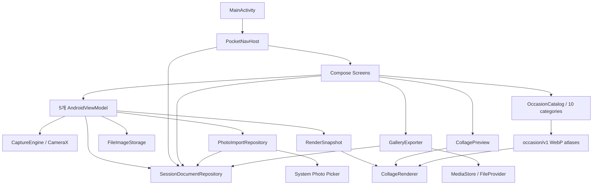
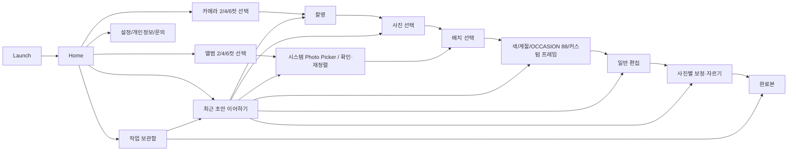

# Pocket 4Cut 현재 구현 아키텍처

> 확인일: 2026-09-24. 앨범 가져오기·사진별 비파괴 자르기 작업의 시작 기준은 `main`의 `ee621886f1ef283e7a555a64fd07577a469b1264`, 구현 브랜치는 `codex/album-import-crop`이다. 이 문서는 Everyday Editions 88종 런타임 통합을 포함한 현재 작업 트리의 구조를 설명한다. 실제 검사 결과와 커밋 상태는 [WORKLOG](WORKLOG.md)의 2026-09-24 항목을 따른다.
> 2026-09-22 실기기 후속 작업은 시작 HEAD `1b705cb3cd813efc062eefeed807f595e4b7adf2` 이후의 미커밋 코드까지 반영한다. 실행 범위와 남은 관문은 [실기기 최종 출시 후보 검증](../engineering/PHYSICAL_RELEASE_VERIFICATION_2026-09-22.md)을 따른다.
> 아래는 소스에서 확인한 구현이다. 커밋·push 및 빌드·기기 검증 결과는 [WORKLOG](WORKLOG.md)의 해당 실행 기록을 따른다. 코드의 존재를 테스트 통과나 모든 장애 복구 완료로 해석하지 않는다.

루트의 [ARCHITECTURE.md](../ARCHITECTURE.md)는 목표 계층과 예시를 포함한 초기 설계 문서다. 이 문서는 현재 호출 관계와 저장 계약을 설명하며, 이전 감사 결과를 현행 결함 목록으로 그대로 옮기지 않는다.

## 1. 실행 구조와 책임

[settings.gradle.kts](../settings.gradle.kts)에 등록된 모듈은 `:app` 하나다. Kotlin/Compose, CameraX, Android Canvas, JSON 파일, SharedPreferences를 사용한다. Room·Hilt·Koin·DataStore·AWS 서버는 현재 구현에 없다.

[앱 빌드 설정](../app/build.gradle.kts)은 namespace/배포 applicationId `com.pocket4cut`, minSdk 26, compileSdk/targetSdk 36, 버전 `1.5 (6)`이다. 이번 기능 구현은 versionCode/versionName을 변경하지 않았다. Gradle 9.1.0, AGP 9.0.1, Build Tools 36.1.0, Compose compiler plugin 2.2.10과 AGP 내장 Kotlin 지원을 사용한다. Java 코드 대상 11과 Gradle 실행 JDK는 별개다.

- `debug`: applicationId `com.pocket4cut.qa`, 버전 이름에 `-qa`를 붙여 배포 앱과 데이터를 분리한다.
- `release`: R8 최적화·난독화와 리소스 축소를 활성화한다. 실제 배포 서명은 별도 설정이다.
- `qaRelease`: release 설정을 상속하되 QA applicationId와 debug 서명을 사용한다. 최적화된 QA APK이며 스토어 배포 APK가 아니다.

[MainActivity](../app/src/main/java/com/pocket4cut/MainActivity.kt)는 테마·설정 복원, edge-to-edge와 시스템바 설정, 화면 켜짐 유지, Compose 테마와 Scaffold, NavHost를 연결한다.

[HomeScreen](../app/src/main/java/com/pocket4cut/presentation/home/HomeScreen.kt)의 상단 라벨과 홈의 프린트 미리보기 브랜드 문구는 `Pocket 4Cut`으로 통일했다. 마지막 QA APK의 실기기 Home UI 트리에서 두 문자열을 확인했다. 이 UI 문자열은 최종 결과 JPEG의 별도 렌더 입력과 구분한다.



MVVM을 부분적으로 적용한다. 저장소는 여러 호출부에서 직접 생성하며, 구현체 사이의 정적 Mutex가 동일 프로세스 접근을 직렬화한다. Application 컨테이너를 통한 단일 인스턴스 DI나 전 화면의 UseCase 계층이 도입된 것은 아니다. NavHost·일부 화면에도 저장소 접근과 Bitmap 디코드가 남아 있다.

## 2. 화면 흐름과 초안 복원

[NavHost](../app/src/main/java/com/pocket4cut/presentation/navigation/PocketNavHost.kt)는 카메라·앨범 입력 방식과 각각의 초안 재개 route를 등록한다.



촬영 구성은 2컷: 4장 중 2장, 4컷: 8장 중 4장, 6컷: 10장 중 6장이다. 매 컷 카운트다운은 [AppSettings](../app/src/main/java/com/pocket4cut/presentation/settings/AppSettings.kt)의 설정을 사용하며 기본값은 여전히 3초다. 화면 켜짐 유지 OFF, 전면 카메라 ON, 자동 사진첩 저장 OFF, 날짜 기본 표시 OFF가 기본 설정이다.

앨범 구성은 완성 장수와 같은 2·4·6장을 시스템 `PickMultipleVisualMedia(ImageOnly)`로 고른다. 지원 기기는 시스템 Photo Picker를, 미지원 기기는 Activity Result 계약의 `ACTION_OPEN_DOCUMENT` fallback을 사용한다. `PhotoImportScreen`은 선택 취소를 빈 상태로 유지하고, 성공한 앱 전용 사본을 번호·썸네일로 보여 주며 추가·제거·드래그/TalkBack 순서 변경을 제공한다. 정확한 장수가 준비된 경우에만 레이아웃으로 이동한다. Manifest는 API 26–29의 가능한 기기에 공식 Photo Picker backport 설치를 요청하며 전체 사진 읽기 권한은 선언하지 않는다.

- Home은 수정 시각이 가장 최근인 재개 가능한 초안 하나를 보여 준다. 초안은 여러 개 보존되며 Gallery에서도 나열한다. `NEEDS_RECOVERY`는 자동 이어하기 대상에서 제외한다.
- Capture는 새 세션을 촬영 전에 만들고 `SavedStateHandle`에 세션 ID를 둔다. `ON_STOP`에서 일시 중지하고 복귀 후 사용자 재개 동작을 기다린다. 진행 중인 단일 촬영은 완료 파일 게시를 마친 뒤 멈추는 경로가 있다.
- Capture의 빠른 전·후면 전환은 별도 `cameraSwitchJob`과 기존 CameraX 바인딩 Mutex를 함께 사용한다. 바인딩 완료 전 전환 중복 입력과 촬영 시작/재개를 보류하고, 실패 시 원래 렌즈 재바인딩을 시도한다. 이것은 모든 제조사의 카메라 연결 실패를 자동 복구한다는 보장은 아니다.
- Selection은 저장된 photo ID 순서를 인덱스로 변환하여 화면을 복원한다. 선택 변경과 다음 단계 이동을 저장소에 반영한다. 시스템 뒤로가기도 화면 닫기 버튼과 동일한 작업 일시정지 확인창을 사용한다. `홈으로`는 저장 성공을 확인한 뒤 NavHost가 Home route까지 pop하며, 저장 중에는 중복 이탈·선택·다음 입력을 막고 실패하면 화면에 남는다. 보관함에서 재개한 선택 화면도 이 정책을 따른다. 관련 내비게이션 계측과 보관함 재개 후 실제 수동 Home 이동을 확인했다.
- PhotoImport는 첫 유효 사진이 게시될 때 `IMPORT` 세션을 만들고, 완료된 사진과 순서를 즉시 초안에 남긴다. 새 가져오기의 세션 ID는 화면의 `rememberSaveable`에 유지하고, 작업 보관함에서 재개할 때는 route로 기존 세션 ID를 받는다. ViewModel은 이 ID의 import journal을 재생한다. 초과 callback은 일부를 임의 채택하지 않고 전체를 거절한다.
- 프레임 선택 화면은 `COLOR`, `SEASON`, `OCCASION 88`, `CUSTOM` 네 방식을 제공한다. OCCASION 화면은 10개 카테고리와 88개 썸네일을 LazyGrid로 표시하고, 적용하기 전 탐색은 세션 확정값을 바꾸지 않는다. 11개 `special` 항목은 `직접 기록`으로 표시하며 날씨·위치·D-Day·횟수를 자동 계산하지 않는다.
- 프레임 선택 단계·커스텀 디자인과 적용한 occasion ID/디자인 버전은 세션 초안에 기록한다. 색상·계절·커스텀은 frame destination의 내부 단계이고, 88종 카탈로그는 별도 `OCCASION_FRAME_PICK` destination이다. occasion 적용 성공 시 전용 picker를 Edit로 교체하므로 Edit에서 뒤로가면 저장된 inline occasion 단계 하나만 나타난다.
- Edit는 문구·필터·순서 등을 자동 저장하고, 상세 편집 이동과 화면 내 나가기에서 저장 완료 후 콜백을 실행한다. Detail은 회전·반전·색 보정과 crop을 photo ID별로 저장한다. Detail에서 돌아온 Edit는 세션을 다시 읽어 변환된 사진과 crop을 공통 미리보기에 반영한다.
- 모든 route가 ID 하나만 받도록 바뀐 것은 아니다. frameType·선택 인덱스·layout/theme 인자와 Base64 결과 경로가 아직 존재한다. 실제 선택·순서·보정 복원의 기준은 세션 문서다.

일반 뒤로 가기는 자료를 유지한다. 일반·상세 편집의 시스템 뒤로 및 커스텀 프레임 이탈은 저장 완료 경로로 연결된다. 문구 입력 debounce 직후 **프로세스를 강제로 종료**하는 경우까지 무손실로 보장하는 것은 아니다.

설정의 카운트다운 슬라이더는 [AppSettings](../app/src/main/java/com/pocket4cut/presentation/settings/AppSettings.kt)의 현재 값을 직접 표시하고 값 변화 때 SharedPreferences에 반영한다. `SettingsScreen`의 닫기 콜백은 [NavigationGuard](../app/src/main/java/com/pocket4cut/presentation/navigation/NavigationGuard.kt)를 거쳐 현재 destination이 설정일 때만 pop하므로 빠른 연타가 홈까지 제거하지 않는다. 화면 켜짐 유지 설정의 기존 계약은 이번 실기기 변경에서 건드리지 않았다.

## 3. 세션 문서와 레거시 이전

[SessionDocument](../app/src/main/java/com/pocket4cut/domain/model/SessionDocument.kt)의 현재 `schemaVersion`은 3이다.

- 문서: sessionId, revision, 생성/수정 시각, 촬영/선택 수, 명시적 `frameTypeId`, `inputSource`, stage, photos, draft, results, exportOperations.
- PhotoRef: 안정적 photoId, 경로, captureIndex, legacy 여부. 신규 경로는 앱 Pictures 루트 기준 상대 경로이며 기존 자료는 검증된 절대 경로를 유지할 수 있다.
- SessionDraft: `selectedPhotoIdsInOrder`, photo ID별 회전·반전·밝기·대비·채도·`PhotoCrop(focusX, focusY, zoom)`, layout/theme/color ID, layoutVersion, 프레임 단계, 필터·문구·날짜·글꼴·계절·커스텀 디자인, `occasionThemeId`와 `occasionDesignVersion`.
- ResultRecord: 결과 ID, 원본 draft revision, 고유 파일 경로, 폭/높이, 생성 시각, legacy 여부. 새 적용은 결과를 덮어쓰지 않고 추가한다.
- ExportOperation: 작업/결과 ID, 상태, URI, 표시 파일명, 생성 시각, 새 사본 여부.

[SessionDocumentRepository](../app/src/main/java/com/pocket4cut/data/local/SessionDocumentRepository.kt)는 `filesDir/session_documents/<id>.json`을 저장한다. 모든 인스턴스가 프로세스 Mutex를 공유하고 `expectedRevision`을 검사한다. `AtomicFile`로 쓰며 정상 이전 문서를 `<id>.json.lastgood`에 보관한다. 손상 시 복구 사본을 `NEEDS_RECOVERY`로 표시하고 `recover()`는 손상 원문을 별도 파일로 보존한다. 미래 스키마는 지원 오류로 반환한다. 결과 JPEG 게시 의도는 별도 `filesDir/result_publications/<id>/<resultId>.json` AtomicFile에 선기록한다. 이 장치는 다중 프로세스 잠금이나 모든 JPEG와 JSON 사이의 단일 트랜잭션을 뜻하지 않는다.

schema v1은 `(captureCount, selectedCount)`가 `(4,2)`, `(8,4)`, `(10,6)`인 경우에만 각각 2·4·6컷 CAMERA 세션으로 메모리 이전한다. crop은 중립값이다. schema v2는 occasion 필드를 `null`로 채워 메모리에서 v3로 읽고, 두 구버전 모두 다음 정상 저장에서만 v3 JSON을 원자 게시한다. v1의 그 밖의 조합은 4컷으로 추측하지 않고 `NEEDS_RECOVERY`로 남긴다. 미래 session schema는 지원 오류로 거절한다.

occasion 선택의 지속 계약은 `backgroundType="occasion"`, 카탈로그에 있는 `occasionThemeId`, 지원하는 `occasionDesignVersion=1`의 조합이다. `frameStep`은 현재 둘러보는 하위 화면을 나타내므로 적용 이후 `edit` 등으로 바뀔 수 있다. 세 값이 불완전하거나 ID가 카탈로그에 없거나 디자인 버전이 미래 값이면 흰 프레임으로 대체하지 않고 문서를 `NEEDS_RECOVERY`로 표시한다. 기존 완료 JPEG는 다시 렌더하지 않는다.

단일 구형 `sessions.json` 가져오기가 실패해도 `scanForGallery()`는 읽을 수 있는 새 세션별 문서를 반환하고, `legacyMigrationError`를 함께 올린다. Home/보관함은 구형 자료의 미표시 가능성을 사용자에게 알린다. 소유 관계를 판단할 수 없으므로 이 상태에서는 새 세션의 실제 파일 삭제를 시작하지 않으며, 삭제 저널의 마무리도 보류한다. 구형 원본 파일 자체는 보존한다. 격리된 손상 fixture의 정상 결과 표시·원문 보존·삭제 차단 계측은 통과했다. 실제 사용자 구형 파일을 손상시킨 검사는 아니다.

게시 저널의 새 결과 JPEG가 손상되면 정상 문서와 이전 완료본은 계속 열람할 수 있다. 조회 응답은 복구 필요 단계로 표시되며 편집/새 결과 준비는 거부된다. 보관함의 후보별 격리 조작은 미완료 게시 JPEG·`.tmp`와 journal만 앱 소유 복구 위치로 옮긴다. 중단된 격리는 intent를 읽어 재개한다. `recover()`는 손상된 세션 JSON의 직전 정상본 복구에 한정하며, 미래 스키마를 이전 버전으로 덮어쓰지 않는다. 읽을 수 없는 문서 하나가 정상 세션의 보관함 표시를 막지 않도록 `scanForGallery()`를 사용한다. 마지막 정상본도 없는 문서는 확인 후 숨김 marker만 기록하며 원본 JSON·JPEG를 바꾸지 않는다. 숨긴 기록 목록에서 marker를 제거해 다시 표시할 수 있다. 숨긴 문서가 존재하는 동안에는 다른 세션 사진의 참조 여부를 판정할 수 없어 물리 파일 삭제를 중단한다.

레거시 이전은 다음과 같다.

- `sessions.json`, `pending_collage_<id>.json`, `frame_selection_<id>.json`, 촬영 폴더를 읽는다.
- 기존 `imagePaths`를 이미 선택된 사진 목록으로 해석한다. 전체 촬영 기준 `selectedIndexes`를 다시 적용하지 않는다.
- 유효한 pending 순열을 photo ID 순서로 옮긴다. 기존 세션 ID·사진·완료 JPEG를 유지하며 재압축·재렌더하지 않는다.
- 기존 layout과 theme 의미, 누락 파일·잘못된 순서 등을 구분한다. 불명확한 세션과 인덱스 없는 촬영/초안은 `NEEDS_RECOVERY`로 보존한다.
- 신규 문서와 삭제 tombstone이 있으면 재수입하지 않는다. 정상 이전만으로 legacy 원본을 자동 삭제하지 않는다.

레거시 전체 JSON 파싱 오류나 일부 잘못된 레코드는 이전/목록 조회를 중단시킬 수 있다. 파일별 복구 API가 있다고 해서 모든 레거시 손상에 대한 사용자 복구 도구가 완성된 것은 아니다. 이전 버전에서 이미 축소된 원본이나 저장되지 않은 보정값은 복원할 수 없다.

## 4. 촬영 파일과 삭제 소유권

[FileImageStorage](../app/src/main/java/com/pocket4cut/data/storage/FileImageStorage.kt)의 활성 경로는 다음과 같다.

```text
getExternalFilesDir(Pictures)/Pocket4Cut/
  captures/<sessionId>/.pending/<uuid>.jpg
  captures/<sessionId>/cap_01.jpg
  imports/<sessionId>/.pending/<photoId>.part
  imports/<sessionId>/<photoId>.<검증된 확장자>
  results/<sessionId>_<resultId>.jpg
```

새 촬영은 임시 파일 → JPEG marker/크기 검사 → 고유 촬영 슬롯 파일 게시 → 세션 photo 기록 순서다. 손상 pending 파일은 슬롯에 게시하지 않고 폐기한다. 현재 Capture 경로에서는 `rewriteJpegMaxLongEdge()`를 호출하지 않으므로 CameraX JPEG를 2048px로 덮어쓰지 않는다. 파일 게시 후 문서 기록 전 중단된 촬영본은 재개 시 다시 검사하여 등록한다. 세션 생성·복원 중 Home 전환도 일시정지 요청으로 유지하고 늦은 CameraX 콜백의 미게시 파일을 정리한다. 미리보기는 축소 디코드한 메모리 Bitmap을 사용하며 별도 영속 proxy 파일 캐시는 아직 없다.

[PhotoImportRepository](../app/src/main/java/com/pocket4cut/data/importing/PhotoImportRepository.kt)는 외부 URI를 장기 사진 경로로 저장하지 않는다. URI를 읽기 전 `PREPARED` journal을 쓰고, `.pending`으로 한 장씩 복사하며 SHA-256·실제 바이트 수를 계산한 뒤 `fsync`, signature·decode bounds·용량 검증, 같은 파일시스템 rename, 세션 반영을 수행한다. journal 상태는 `PREPARED → COPYING → FILE_PUBLISHED → SESSION_COMMITTED`다. signature와 bounds만 믿지 않고 긴 변 1,024px 이하로 sampled pixel decode까지 성공해야 게시한다. JPEG·PNG·정적 WebP와 이 기기에서 실제 decode되는 HEIF/HEIC만 허용하고 64MiB·긴 변 32,768px·250MP 상한을 적용한다. 외부 원본에는 쓰기·이름 변경·삭제를 하지 않는다.

개별 가져오기 화면은 자신의 세션 journal을 재생한다. 추가로 Home과 작업 보관함은 세션 문서를 스캔하기 전 `recoverAll()`을 호출해 `import_journals`/`import_removals`의 모든 세션 디렉터리를 재생한다. 따라서 첫 파일이 게시됐지만 첫 `SessionDocument`를 만들기 전 프로세스가 끝난 창도 journal로 세션 반영을 재개한다. 세션 하나의 복구 실패는 다른 journal과 정상 세션 스캔을 막지 않고 Home/보관함 경고로 올린다. 동일 photoId는 세션에 중복 반영하지 않고, 게시 파일만 남은 경우 해시·signature·bounds·실제 pixel decode를 다시 확인해 commit을 끝낸다. URI grant가 사라진 미완료 pending은 해당 항목만 정리하고 재선택 필요로 표시한다.

사진 제거는 별도 intent journal을 먼저 쓴 뒤 세션 참조를 제거하고 해당 세션의 import 사본만 삭제한다. 재생 전에 journal JSON의 sessionId/photoId, journal 파일명, 타겟 파일명의 PhotoId, 정규화한 `imports/<sessionId>/<photoId>.<ext>` 상대 경로, 현재 `PhotoRef.path`와 intent 경로의 일치를 확인한다. 이 중 하나라도 다르면 세션 참조나 파일을 제거하지 않고 복구 실패로 남긴다.

새 결과는 게시 저널 기록 → 임시 JPEG 인코딩·동기화 → 고유 경로 게시 → ResultRecord 추가 순서다. 이전 `<sessionId>_result.jpg`는 legacy 완료본으로 남는다. 파일 게시 후 문서 기록 전에 중단되면 다음 세션 조회에서 유효한 JPEG를 한 번만 결과로 등록한다. 파일이 생성되기 전에 중단된 저널은 보존하고 자동 게시하지 않는다. 촬영·삭제·사진첩까지 아우르는 단일 파일 작업 transaction은 없다.

삭제는 SessionDocumentRepository가 담당한다.

- 완료본이 없는 초안 버리기는 세션 삭제로 이어진다.
- 완료본이 있는 초안 버리기는 draft를 초기화하고 완료본·사진은 유지한다.
- 세션 삭제는 tombstone을 먼저 기록하고 앱 소유 사진·완료본·초안·게시 저널·손상 원문·관련 세션 메타데이터를 정리한다. 다른 세션이 참조하는 파일은 보존한다.
- 실패는 오류로 전달하며 다음 조회에서 미완료 삭제를 재시도하는 경로가 있다. Settings의 전체 삭제는 진행 중 초안도 포함한다고 안내한다.
- 공용 MediaStore 사본은 이 삭제 범위에 포함하지 않는다.

복구 API가 보존한 `<id>.corrupt.<timestamp>` 원문은 해당 세션 삭제 시 이름·부모 경로를 확인한 뒤 정리한다. 삭제 테스트는 합성 자료가 있는 격리 저장소에서 수행한다.

## 5. 렌더링과 출력 규격

활성 경로는 `DetailEditViewModel → RenderSnapshot → CollageRenderer → prepareResultPublication → saveImmutableResult → completeResultPublication`이다.

[RenderSnapshot](../app/src/main/java/com/pocket4cut/frame/RenderSnapshot.kt)은 저장된 한 revision에서 선택 순서, 실제 파일, photo ID별 보정·crop, 프레임·문구·날짜와 occasion ID/디자인 버전을 고정한다. `CropMath`는 EXIF 정규화 원본 좌표의 focus를 사용자 90도 회전·좌우 반전 뒤 좌표로 변환하고, `baseScale × zoom`과 허용 focus 범위를 계산해 빈 가장자리를 막는다. 중립 crop은 기존 중앙 aspect-fill과 같은 연산 순서를 유지한다.

최종 렌더에서 `CollageRenderer.slotImageProvider`는 각 출력 슬롯의 실제 크기를 받는다. 중립이 아닌 crop은 `CropMath.visibleSourceRect()`로 EXIF 정규화 원본의 표시 영역을 먼저 구하고 JPEG·PNG·정적 WebP는 그 영역만 region decode한다. 이후 사용자 회전·반전과 필터·색 보정을 적용하고, 이미 자른 Bitmap은 중립 transform으로 그린다. HEIF/HEIC처럼 region decode 대상이 아닌 형식이거나 decoder가 실패하면 원본 전체를 6MP 상한으로 sampled decode한 뒤 기존 crop transform을 적용한다. 중립 crop도 기존 픽셀 호환을 위해 이 전체 decode 경로를 사용한다. provider가 반환한 Bitmap은 해당 슬롯을 그린 뒤 회수하며 UI가 보유한 preview Bitmap과 수명을 공유하지 않는다.

[CollagePreview](../app/src/main/java/com/pocket4cut/frame/CollagePreview.kt)는 Compose Canvas에서 최종 출력과 같은 [CollageRenderer.drawScene](../app/src/main/java/com/pocket4cut/frame/CollageRenderer.kt), 슬롯 기하와 `CropMath`를 호출한다. 따라서 선택 순서·슬롯·focus·zoom·회전·반전과 배경 → 사진 → 외곽·슬롯 테두리 → 계절/occasion 장식·제목 → 브랜드·문구·날짜 → 사용자 장식 순서를 공유한다. 미리보기는 화면 크기의 축소 Bitmap, 최종 출력은 슬롯 크기를 알고 원본에서 디코드한 Bitmap을 사용한다. 공통 장면·crop 계약은 유지하지만 해상도가 다르므로 모든 픽셀이 완전히 같다는 의미는 아니다.

2026-09-22 Paper Seasons 변경은 위 기준 커밋 이후의 계절 자산 교체다. `SeasonalStickerArt`가 번들 RGBA atlas(시즌당 1536×1024)를 IO에서 읽고 최대 2개를 캐시한다. 캐시 이탈 시 UI가 보유한 Bitmap을 recycle하지 않는다. 미리보기는 시즌별 비동기 로딩·오류/재시도를 사용하고, 최종 렌더는 스냅샷의 시즌을 먼저 로드하여 같은 `Input.seasonalArt`로 전달한다. 사진·브랜드·문구 영역을 제외하는 동일한 배치 함수를 사용한다. 저장된 `sourceSeason` 및 layoutVersion은 유지하고 레이아웃 선택·프레임 선택·일반 편집에서도 기존 배치 버전을 전달한다. 이번 변경의 실행 검증은 WORKLOG의 Paper Seasons 항목을 따른다.

Everyday Editions는 [OccasionCatalog](../app/src/main/java/com/pocket4cut/frame/occasion/OccasionCatalog.kt)가 `assets/occasion/v1/catalog.json`을 엄격히 읽고, [OccasionArtwork](../app/src/main/java/com/pocket4cut/frame/rendering/OccasionArtwork.kt)가 선택한 1536×1024 알파 WebP만 `inScaled=false`, ARGB_8888로 디코드한다. LRU는 2장으로 제한하며 UI가 참조할 수 있어 이탈 Bitmap을 직접 recycle하지 않는다. 목록은 별도 240×160 썸네일을 사용한다. [OccasionFramePainter](../app/src/main/java/com/pocket4cut/frame/rendering/OccasionFramePainter.kt)는 종이색·패턴, 사진 테두리, header/side/gutter/footer 장식과 제목을 현재 Canvas 기하에 그린다. 미리보기와 원본 기반 최종 저장은 같은 `CollageRenderer.Input.occasionTheme/occasionArtwork`와 painter를 사용한다. 622,173,556 bytes의 완성 PNG 1,584장은 앱에 포함하지 않는다.

일반 편집의 필터 전환은 전체 사진 Bitmap을 매번 복제하지 않고 `orderedImages`와 `filterId`를 공통 Canvas에 전달한다. 필터 칩의 작은 thumbnail만 별도로 생성한다. 커스텀 장식의 화면 배치는 좌상단 기준 정규화 좌표에 맞췄으나 편집기의 장식 텍스트 표시와 최종 Canvas 텍스트 줄바꿈은 아직 별도 경로다.

- 레이아웃 8개를 제공한다. `SIX_COLLAGE`의 layoutVersion 2는 첫 사진이 큰 슬롯을 차지하는 비대칭 6컷이다. layoutVersion 1은 과거 3×2 기하를 유지한다.
- 비대칭 6컷의 논리 사진 영역은 x=20부터, y=40부터 시작해 마지막 슬롯 아래 y=500에 끝난다. 390×545/585 캔버스와 3:4 작은 슬롯, 문구 영역 시작 y=525를 유지하면서 계절 footer와 문구 간격을 확보한다.
- 클래식 `FOUR_VERTICAL`은 1650×4920px다.
- 나머지 출력은 [CollageOutputSize](../app/src/main/java/com/pocket4cut/frame/CollageOutputSize.kt)가 프레임 기하에서 계산한다. 가장 작은 사진 슬롯의 짧은 변 1024px를 목표로 하되 16,000,000 pixels와 각 변 8192px 상한을 적용한다. 상한 때문에 목표 슬롯 크기를 낮출 수 있다.
- 출력은 화면 해상도에 의존하지 않는다. 문구·날짜, 배치와 theme에 따라 높이와 최종 치수가 달라지므로 모든 결과가 같은 크기는 아니다.
- JPEG 품질은 98이며 투명 출력 기능은 없다. MediaStore로 복사할 때 재압축하지 않는다.

스티커는 [StickerVectorPainter](../app/src/main/java/com/pocket4cut/frame/StickerVectorPainter.kt)가 카탈로그의 Material ImageVector path를 그린다. 스티커 이름 문자열을 도형 대신 출력하던 경로는 교체되었다. 프레임 카탈로그 색 ID 검색, gradient stops, 라디안 회전 저장, 문구 영역 계산도 연결되어 있다. 자산 규격과 남은 렌더 제약은 [IMAGE_ASSET_GUIDE](IMAGE_ASSET_GUIDE.md)를 따른다.

## 6. 사진첩 내보내기·공유·권한·백업

[GalleryExporter](../app/src/main/java/com/pocket4cut/data/export/GalleryExporter.kt)가 `AUTO`, `SAVE`, `SAVE_COPY`와 결과 상태를 정의한다. ResultScreen의 일반 UI는 자동/수동 저장을 사용하며 새 사본 저장은 exporter API에 존재한다.

- ResultScreen의 결과 경로 조회는 `scanForGallery()`에서 정상 세션별 문서를 독립적으로 찾는다. 관계없는 손상 세션별 문서나 구형 단일 `sessions.json` 오류 때문에 정상 완료본의 결과 ID 연결을 모두 잃지 않도록 하고, 구형 오류는 별도 경고로 전달한다. 화면 `ON_RESUME`에는 exporter가 기록된 일반 사본의 MediaStore 행·바이트·pending 상태를 검사해 저장 완료 표시를 다시 계산한다. 구형 단일 파일이 손상된 경우 그 안의 아직 옮겨지지 않은 작업은 자동 복구됐다고 표시하지 않는다.
- 정상 결과별 기존 작업을 재사용하고, insert 전 operation ID와 표시 파일명을 저장한다.
- PREPARED → INSERTED → COPIED → PUBLISHED → COMPLETED 상태와 URI를 세션 문서에 기록한다. 복사 중에는 SHA-256으로 원본/공용 사본 바이트를 비교한다.
- API 29 이상은 pending 행을 만든 뒤 공개하고, update 결과를 확인한다. 복사 실패는 생성 행 삭제를 시도하고 불확실하면 `NEEDS_RECOVERY`로 남긴다.
- API 29 이상에서는 pending 행도 조회해 PREPARED 작업 이후 중단되었을 때 동일 작업과 MediaStore 행을 재사용한다. 행이 없음을 확인한 경우에만 같은 작업으로 삽입을 다시 시작한다.
- 기록 URI가 없는 작업에서 같은 작업 이름의 **pending 행**이 확인되었지만 바이트가 불완전할 때는 그 행을 INSERTED 단계로 이어받아 같은 결과를 다시 복사한다. 새 행을 무조건 추가하거나 공개·소유 불명 행을 덮어쓰지 않는다. 격리된 부분 pending 행 계측은 연결 실기기에서 통과했다. 실제 저장 도중 강제 프로세스 종료의 모든 타이밍을 검사한 것은 아니다.
- 기록된 COMPLETED URI의 행이 실제로 사라지고 같은 작업 이름의 다른 행도 없음을 확인한 때만 기존 operation ID로 삽입을 재개한다. 바이트가 달라졌거나 provider의 응답이 불명확하면 중복 삽입 대신 `NEEDS_RECOVERY`로 남긴다.
- API 26–28은 WRITE 권한을 확인하고 ResultScreen이 runtime 요청·허용 후 재시도를 수행한다. 소유자를 확정할 수 없는 구버전 중단 행은 자동 재삽입 대신 복구 필요로 반환한다.
- 새 렌더 결과로 이동할 때만 auto route 표시를 전달한다. Gallery에서 결과를 여는 것만으로 자동 저장하지 않으며 legacy 완료본은 AUTO를 거부한다.
- 공유는 앱 소유 결과를 확인한 뒤 FileProvider content URI와 임시 읽기 권한을 사용한다. 외부 수신 앱에서의 실제 전송은 별도 검증 대상이다.

[Manifest](../app/src/main/AndroidManifest.xml)는 CAMERA와 API 28 이하 WRITE만 선언한다. READ_MEDIA_IMAGES/READ_MEDIA_VISUAL_USER_SELECTED/READ_EXTERNAL_STORAGE와 INTERNET 선언은 없다. Camera 화면은 설정 복귀 시 권한을 재확인한다. FileProvider는 `Pictures/Pocket4Cut/results/`만 공개하여 import 원본이 공유 URI로 노출되지 않게 한다.

[backup_rules](../app/src/main/res/xml/backup_rules.xml)와 [data_extraction_rules](../app/src/main/res/xml/data_extraction_rules.xml)는 `pocket4cut_settings.xml`, `pocket4cut_theme.xml`만 허용한다. 클라우드·기기 이전 모두 사진·초안·세션·export 기록을 포함하지 않는 설정이다. 실제 Android 백업/복원 실행을 검증했다는 뜻은 아니며, 내보내지 않은 앱 자료가 기기 교체 시 자동 복원된다고 안내해서는 안 된다.

## 7. 테스트와 남은 경계

JVM 테스트는 기존 기본 검사 외에 crop 회전/반전 좌표·역변환·clamp/no-blank·neutral 호환, Photo Picker 초과/중복 정책과 occasion 선택 계약을 다룬다. 계측 소스에는 패키지·Bitmap 수명, 렌더 계약, 출력 치수/버전별 6컷, revision·손상 복구·legacy 이전·삭제 소유권·export 직렬화에 더해 schema v1/v2/v3, import 형식/해시/재생/격리, crop renderer, PhotoImport 접근성, FileProvider 노출 범위, occasion 카탈로그 88종·선택 UI·1,584 렌더 조합 검사가 있다. 소스의 테스트 존재와 특정 실행의 통과 결과는 구분한다.

[Android CI](../.github/workflows/android-ci.yml)는 PR·main push·수동 실행에서 debug 빌드, JVM 테스트, Lint, qaRelease 빌드를 정의하고 API 28/36 emulator 계측 작업을 포함한다. workflow 추가만으로 원격 CI 실행 성공을 주장하지 않는다. [Pages workflow](../.github/workflows/github-pages.yml)는 여전히 `docs/` 전체를 공개 배포한다.

현재 남은 경계는 다음과 같다.

- NavHost에 저장소 I/O와 일부 Bitmap 디코드가 남아 있고, 모든 화면의 lifecycle 수집·뒤로가기·오류 UI가 통일된 것은 아니다.
- 초안 자동 저장 지연, 결과 외 파일/문서 게시 간 중단, 저메모리·용량 부족·권한 회수의 전 조합 검증이 필요하다.
- 복구 필요 상태의 원인별 사용자 복구 흐름과 MediaStore의 모든 장애 주입 테스트는 후속 과제다.
- 출력 해상도 상한은 전체 앱 메모리 사용량 상한이 아니다. 최종 Bitmap, 처리 중 슬롯, 화면 Bitmap의 동시 메모리를 별도로 측정해야 한다.
- 현재 layoutVersion은 있으나 모든 결과에 독립적인 renderer 버전·콘텐츠 해시·설치 ID가 기록되는 스키마는 아니다.
- occasion 자산 생성기의 88개 파일/알파/해시/품질 검증과 Android 계측 소스가 있어도, 전체 88종을 실제 기기에서 선택·저장·재열기하고 저메모리·빠른 전환·TalkBack까지 확인하기 전에는 실기기 검증 완료로 표시하지 않는다.
- `domain.repository.SessionRepository`, placeholder UseCase, 이전 `CollageFinalize`와 `FileImageStorage.saveResult`는 남아 있다. 이전 helper를 활성 저장 계약으로 오인하여 재사용하지 않는다.
- 개인정보 문구·사용자 안내와 실제 백업/삭제 범위의 일치, release/R8, 물리 카메라와 접근성은 각 변경의 검증 기록으로 확인한다.

새 의존성·DB·모듈 분리는 위 책임과 복구 계약을 먼저 검증한 뒤 필요에 따라 결정한다.
