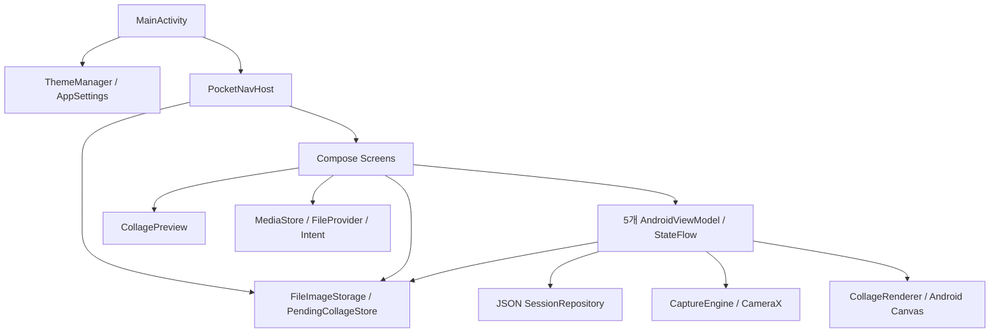
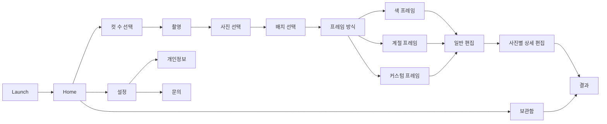

# Pocket 4Cut 현재 구현 아키텍처

> 확인일: 2026-09-10. 기준은 HEAD `95140a0`과 조사 시점의 `app/` 미커밋 변경 27개를 포함한 작업 트리다.
> 이번 반영 범위는 문서다. 로컬 앱 변경이 함께 커밋되거나 원격 브랜치에 반영되었다는 의미가 아니다.
> 아래는 소스에서 확인한 구조이며, 기기에서 전체 기능의 정확성을 검증했다는 선언이 아니다.

이 문서는 현재 호출 관계를 설명한다. 루트의 [ARCHITECTURE.md](../ARCHITECTURE.md)는 목표 계층과 예시 클래스가 포함된 기존 설계 문서이므로 구분해서 읽는다. 구현 변경 시 실제 코드와 이 문서를 함께 갱신한다.

## 1. 실행 구조와 책임

Pocket 4Cut은 촬영·사진 선택·프레임 편집·콜라주 생성·보관을 기기에서 수행하는 Android 앱이다. [settings.gradle.kts](../settings.gradle.kts)에 등록된 Gradle 모듈은 `:app` 하나다.

[앱 빌드 설정](../app/build.gradle.kts)의 applicationId/namespace는 `com.pocket4cut`, minSdk는 26, compileSdk/targetSdk는 36이다. 조사한 작업 트리 버전은 `1.2 (3)`이며 기준 HEAD의 버전은 `1.0 (1)`이다. 버전·UI 관련 로컬 앱 변경은 이번 문서 커밋에 포함하지 않는다. Gradle 8.13, AGP 8.13.2, Kotlin 2.0.21을 선언하며 실행 검증은 [WORKLOG](WORKLOG.md)에 기록한다.

[MainActivity](../app/src/main/java/com/pocket4cut/MainActivity.kt)는 다음 순서로 앱을 시작한다.

1. `ThemeManager`와 `AppSettings`의 저장값을 읽는다.
2. edge-to-edge를 활성화하고 `Pocket4CutTheme`를 적용한다.
3. `rememberNavController`를 생성한다.
4. Scaffold의 inset padding을 적용한 `PocketNavHost`를 표시한다.



MVVM을 부분적으로 사용하지만 `UI → UseCase → Repository interface`가 일관되게 연결된 구조는 아니다. ViewModel이 저장 구현체를 직접 생성하며, NavHost와 일부 화면도 파일을 읽고 결과를 저장한다.

주요 패키지의 실제 책임은 다음과 같다.

- `presentation`: 화면, ViewModel, route, 화면 사이 편집값 인계, 결과 저장 액션.
- `camera`: CameraX preview와 ImageCapture 바인딩, JPEG 촬영 요청.
- `frame`: 프레임·필터 카탈로그, 배치 계산, Compose 미리보기, Canvas 최종 합성, 계절 장식.
- `data`: JPEG 파일과 완성 세션 JSON 저장 구현.
- `domain`: `PhotoSession`, 미연결 저장소 인터페이스, placeholder UseCase.
- `ui`: 실사용 디자인 시스템과 MaterialTheme 연결.
- `core`: Bitmap 디코드·보정, 폰트, 파일 URI, 상수 등 공통 처리.
- `legal`: 앱 내 정적 개인정보 처리방침 콘텐츠.

## 2. 화면과 내비게이션

[PocketNavHost](../app/src/main/java/com/pocket4cut/presentation/navigation/PocketNavHost.kt)에 destination은 **14개**, 실제 연결된 Screen 함수는 **17개**다.



- `frameThemeSelect` destination 안에서 `flowStep`으로 방식 선택·색·계절·커스텀 화면을 전환한다. 네 화면은 별도 navigation entry가 아니다.
- 기본 구조 테마는 `FrameCatalog.themes(frameType).first()`다. 이름이 비슷한 `FrameThemeSelectScreen`은 호출되지 않는다.
- 촬영 완료 시 `popUpTo(HOME)`으로 촬영과 컷 수 선택을 제거한다. Selection에서 뒤로 가면 Home이다.
- Result 진입 시 이전 편집 화면을 제거하지 않는다. 시스템 뒤로는 상세 편집 또는 Gallery로 돌아간다.
- Result의 홈 버튼은 기존 Home까지 제거하고 새 Home을 만든다.

[Routes와 NavCodec](../app/src/main/java/com/pocket4cut/presentation/navigation/Routes.kt)은 `frameType`, `sessionId`, `selectedIndexes`, `layoutId`, `themeId`를 문자열 route 인자로 전달한다. 선택 인덱스는 쉼표로 구분하며 결과 파일 경로는 URL-safe Base64로 인코딩한다. Bitmap 자체를 route에 넣지는 않는다.

촬영 구성은 2컷이 4장 중 2장, 4컷이 8장 중 4장, 6컷이 10장 중 6장을 선택하는 방식이다. 근거는 [Constants](../app/src/main/java/com/pocket4cut/core/util/Constants.kt)다.

## 3. 화면 상태와 편집값 인계

실사용 ViewModel은 모두 `AndroidViewModel`이며 `StateFlow`를 노출한다.

- [CaptureViewModel](../app/src/main/java/com/pocket4cut/presentation/capture/CaptureViewModel.kt): 카메라 연결, 촬영 phase, 카운트다운·진행·줌.
- [SelectionViewModel](../app/src/main/java/com/pocket4cut/presentation/selection/SelectionViewModel.kt): 촬영 경로와 선택 인덱스.
- [EditViewModel](../app/src/main/java/com/pocket4cut/presentation/edit/EditViewModel.kt): 공통 필터, 문구·날짜, 프레임색, 사진 순서와 미리보기.
- [DetailEditViewModel](../app/src/main/java/com/pocket4cut/presentation/detailEdit/DetailEditViewModel.kt): 슬롯별 회전·반전·색 보정과 최종 생성.
- [GalleryViewModel](../app/src/main/java/com/pocket4cut/presentation/gallery/GalleryViewModel.kt): 완성 세션 조회, 날짜·컷 수 그룹과 개별 삭제.

Home·Result·프레임 단계에는 별도 ViewModel이 없다. 배치·프레임 방식·커스텀 장식·보관함 표시 모드·결과 저장 여부 등은 화면의 `remember` 상태다.

[PendingCollageStore](../app/src/main/java/com/pocket4cut/presentation/edit/PendingCollageStore.kt)가 인계를 보조한다. 프레임 선택 완료 시 방식·색·계절·디자인을 저장하고, 일반 편집에서 상세 편집으로 이동할 때 필터·문구·날짜·순서 등을 별도 JSON에 저장한다. NavHost가 이를 읽어 DetailEditScreen의 인자로 전달한다.

현재 NavHost는 경로 조회뿐 아니라 512px/2048px 요청의 Bitmap 디코드도 수행한다. 해당 디코드는 `LaunchedEffect` 안에서 별도 dispatcher 전환 없이 실행된다. 저장 계층의 suspend 함수가 IO에서 실행된다고 해서 그 다음 디코드까지 IO에서 실행되는 것은 아니다.

상태 수명에는 다음 제약이 있다.

- `SavedStateHandle`, `rememberSaveable`, `BackHandler`, `collectAsStateWithLifecycle` 사용이 없다. 화면은 `collectAsState()`로 구독한다.
- Selection은 `load()`할 때 선택을 초기화한다. ViewModel이 유지되어도 화면 재진입 시 선택이 지워질 수 있다.
- 새 EditViewModel은 프레임 선택값만 읽고 이전 pending 편집값을 복원하지 않는다. 상세 보정값도 메모리에만 남는다.
- 프레임 하위 화면의 UI 뒤로는 방식 선택으로, 시스템 뒤로는 배치 선택으로 이동한다. 촬영·선택의 화면 취소 확인도 시스템 뒤로에 통합되지 않았다.

## 4. 이미지 처리와 레이아웃

활성 처리 경로는 다음과 같다.

1. [CaptureEngine](../app/src/main/java/com/pocket4cut/camera/CaptureEngine.kt)이 같은 ViewPort의 Preview/ImageCapture를 바인딩한다.
2. CaptureViewModel이 UUID 세션을 시작하고 매 컷 카운트다운 후 JPEG를 촬영한다. 수동 셔터는 현재 카운트다운을 생략한다.
3. [BitmapDecoding](../app/src/main/java/com/pocket4cut/core/util/BitmapDecoding.kt)이 EXIF 방향을 반영하며 촬영본을 긴 변 최대 2048px, JPEG 품질 92로 정규화한다.
4. 일반 편집은 720px 요청으로 사진을 읽고 필터 미리보기를 생성한다. 디코드 요청 크기가 모든 이미지의 긴 변 상한을 뜻하지는 않는다.
5. 상세 편집의 최종 생성은 파일을 3072px 요청으로 다시 읽어 회전 → 반전 → 전체 필터 → 슬롯별 밝기·대비·채도를 적용한다.
6. [CollageRenderer](../app/src/main/java/com/pocket4cut/frame/CollageRenderer.kt)가 프레임·사진·브랜드·문구·날짜·장식을 합성한다. 이미 처리된 사진에는 `ORIGINAL` 필터를 전달해 이중 적용을 피한다.
7. JPEG 품질 98로 결과를 저장하고 세션 메타데이터를 upsert한 뒤 Result로 이동한다.

[FrameLayouts](../app/src/main/java/com/pocket4cut/frame/FrameLayouts.kt)의 8개 ID는 2컷 세로/가로, 4컷 세로/2×2/가로, 6컷 2×3/3×2/콜라주다. 콜라주 6컷도 3×2이며 자유 배치 알고리즘은 없다. 실제 기하는 [CollageLayoutMath](../app/src/main/java/com/pocket4cut/frame/CollageLayoutMath.kt)가 계산한다.

클래식 세로 4컷은 1650×4920px 고정이다. 나머지 활성 출력 폭은 [CollageExportMetrics](../app/src/main/java/com/pocket4cut/core/util/CollageExportMetrics.kt)의 시스템 화면 폭 기반 720–2160px 값이다. style의 padding/gap 대신 theme의 값을 소비하므로 현재 두 6컷 3×2 ID는 같은 기하를 만든다.

[CollagePreview](../app/src/main/java/com/pocket4cut/frame/CollagePreview.kt)는 Compose, 최종 출력은 Android Canvas를 사용한다. 계절 배경도 Canvas 벡터 처리이며 `SeasonHTMLFrameStyle`이라는 이름이 HTML/WebView 실행을 뜻하지 않는다.

현재 코드에서 확인된 정확성 문제는 수정 전에 반드시 고려한다.

- 일반 편집의 `order`가 pending JSON에 저장되지만 상세 편집 진입 시 적용되지 않아 재정렬이 유실된다.
- `computeForPreview()`가 문구 존재를 공백 문자열로 전달해 textArea를 만들지 않는다. 저장 결과와 문구 영역·사진 배치가 달라진다.
- 카탈로그 색 ID는 `FrameColors.byId()`에서 복구되지 않을 수 있다. 커스텀 디자인의 기존 색이 편집 화면의 새 색보다 우선하는 경로도 있다.
- 스티커는 미리보기에서 vector, 최종 출력에서 이름 문자열로 그려진다. 장식의 회전 단위와 크기 계산에도 두 경로의 불일치가 있다.

이 목록은 코드 분석 결과이며 수정 완료나 기기 E2E 통과를 의미하지 않는다. 순서·색·문구·장식을 바꿀 때 같은 입력의 미리보기와 저장 JPEG를 함께 검증해야 한다.

## 5. 저장 모델과 삭제 범위

[FileImageStorage](../app/src/main/java/com/pocket4cut/data/storage/FileImageStorage.kt)는 앱 전용 외부 Pictures 아래에 JPEG를 보관한다. [data.local.SessionRepository](../app/src/main/java/com/pocket4cut/data/local/SessionRepository.kt)는 내부 `sessions.json` 전체를 읽고 수정해 다시 쓴다. Room DB가 아니다.

```text
filesDir/
  sessions.json
  frame_selection_<sessionId>.json
  pending_collage_<sessionId>.json
getExternalFilesDir(Pictures)/Pocket4Cut/
  captures/<sessionId>/cap_01.jpg ...
  results/<sessionId>_result.jpg
공용 MediaStore: 별도 사본(API29+는 Pictures/Pocket4Cut 지정,
                         API26–28은 MediaStore 기본 경로)
```

[PhotoSession](../app/src/main/java/com/pocket4cut/domain/model/PhotoSession.kt)의 활성 저장 경로에서 `imagePaths`는 선택된 사진 경로, `selectedIndexes`는 전체 촬영 목록의 인덱스다. 서로 같은 배열의 인덱스로 해석하면 안 된다. `frameId`는 layout ID, `createdAt`은 최종 저장 시각이며 파일 경로는 절대 경로다.

완성본 경로가 있는 세션만 보관함에 노출한다. JSON 스키마 버전·migration·동시 쓰기 잠금·원자적 교체는 없다. 전체 JSON 손상은 예외가 되고 개별 항목 파싱 실패는 해당 항목을 건너뛴다.

[ResultScreen](../app/src/main/java/com/pocket4cut/presentation/result/ResultScreen.kt)이 MediaStore 복사와 FileProvider 공유를 직접 수행한다. 보관함 삭제는 공용 사진첩 사본을 지우지 않는다. 내보낸 URI를 기록하지 않아 자동 저장 ON 상태에서 같은 결과를 다시 열면 중복 저장될 수 있다.

촬영·선택 취소는 원본을 삭제하지 않으며, 보관함 전체 삭제는 완성 세션만 순회한다. pending/frame_selection 삭제 함수는 호출되지 않는다. 파일이 남아 있는 것과 편집 초안을 복원할 수 있는 것은 별개다.

## 6. 설정과 디자인 시스템

[AppSettings](../app/src/main/java/com/pocket4cut/presentation/settings/AppSettings.kt)는 SharedPreferences와 싱글턴 Compose state를 함께 사용한다. 기본값은 전면 카메라 true, 카운트다운 3초(1–10초), 자동 사진첩 저장 false, 날짜 표시 false다.

[ThemeManager](../app/src/main/java/com/pocket4cut/ui/designsystem/theme/ThemeManager.kt)는 별도 SharedPreferences로 계절을 저장하며 기본값은 봄이다. 달력에 맞춰 자동 변경하지 않는다.

실사용 토큰과 컴포넌트는 [ui/designsystem](../app/src/main/java/com/pocket4cut/ui/designsystem)에 있다. [ui/theme/Theme.kt](../app/src/main/java/com/pocket4cut/ui/theme/Theme.kt)는 MainActivity가 호출하는 MaterialTheme 연결 계층이며 미사용 코드가 아니다. 다만 최상위 colorScheme 값과 동적 AppColors getter의 갱신 시점이 달라 계절 변경 동기화가 필요하다.

조사 시점 로컬 UI 변경은 종이색·잉크색, 작은 모서리와 계절 강조색을 사용한다. `IconCircleButton`은 사각형 계열이고 `Pink*` 컴포넌트도 실제 색은 테마를 따른다. 이 시각 변경은 문서 커밋만으로 원격 앱에 적용되지 않는다. `core/designsystem`은 TODO다.

## 7. 미연결 구성과 향후 제안

현재 `domain.repository.SessionRepository` 인터페이스는 같은 이름의 data 구현체와 연결되지 않는다. UseCase는 placeholder이며 HomeViewModel·ResultViewModel·FrameViewModel은 없다. Hilt·Koin·Room·DataStore를 사용 중이라고 설명해서는 안 된다.

`FrameThemeSelectScreen`과 일부 프레임 route 상수는 미호출이다. `EditViewModel.renderFinalAndSave() → CollageFinalize`도 현재 화면에서 사용하지 않는 이전 출력 경로다. 이 경로는 활성 상세 편집과 frameId 의미·출력 폭이 달라 재사용 전 검토가 필요하다.

[SERVER_ARCHITECTURE_AWS.md](../SERVER_ARCHITECTURE_AWS.md)의 AWS·로그인·동기화는 미래 설계이며 현재 백엔드 구현이 아니다.

**향후 제안:** 먼저 선택 사진 ID·배열 순서·슬롯 보정·프레임을 하나의 초안 계약으로 정리한다. 그다음 초안 복원·취소·삭제, 저장 실패 복구와 미리보기/출력 공통 계산을 구현한다. NavHost의 I/O를 상태 계층으로 옮기고 오류·뒤로·Bitmap 소유권을 통일한 뒤 DI·DB·모듈 분리 필요성을 결정한다.
