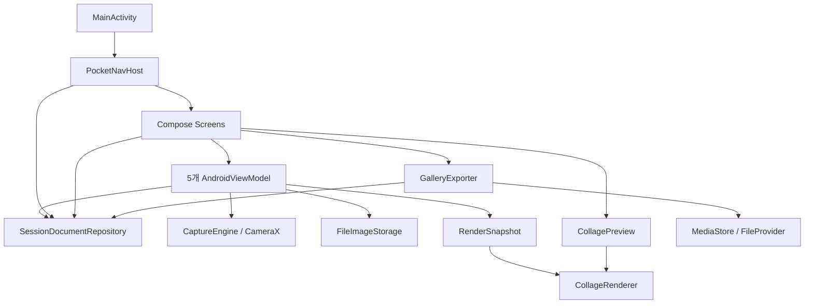
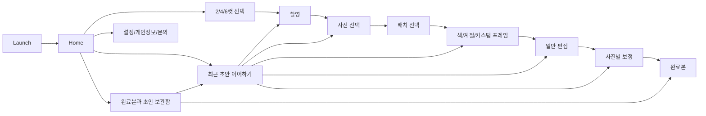

# Pocket 4Cut 현재 구현 아키텍처

> 확인일: 2026-09-22. 기준은 `codex/refactor-reliability`의 앱 소스 커밋 `155ced0b44b381bb8d274d2652d6d2fd421b2973`이다. 시작 기준은 `a0eff04`였으며 본문에 미커밋 기능 변경을 포함하지 않는다.
> 아래는 소스에서 확인한 구현이다. 커밋·push 및 빌드·기기 검증 결과는 [WORKLOG](WORKLOG.md)의 해당 실행 기록을 따른다. 코드의 존재를 테스트 통과나 모든 장애 복구 완료로 해석하지 않는다.

루트의 [ARCHITECTURE.md](../ARCHITECTURE.md)는 목표 계층과 예시를 포함한 초기 설계 문서다. 이 문서는 현재 호출 관계와 저장 계약을 설명하며, 이전 감사 결과를 현행 결함 목록으로 그대로 옮기지 않는다.

## 1. 실행 구조와 책임

[settings.gradle.kts](../settings.gradle.kts)에 등록된 모듈은 `:app` 하나다. Kotlin/Compose, CameraX, Android Canvas, JSON 파일, SharedPreferences를 사용한다. Room·Hilt·Koin·DataStore·AWS 서버는 현재 구현에 없다.

[앱 빌드 설정](../app/build.gradle.kts)은 namespace/배포 applicationId `com.pocket4cut`, minSdk 26, compileSdk/targetSdk 36, 버전 `1.4 (5)`다. Gradle 9.1.0, AGP 9.0.1, Build Tools 36.1.0, Compose compiler plugin 2.2.10과 AGP 내장 Kotlin 지원을 사용한다. Java 코드 대상 11과 Gradle 실행 JDK는 별개다.

- `debug`: applicationId `com.pocket4cut.qa`, 버전 이름에 `-qa`를 붙여 배포 앱과 데이터를 분리한다.
- `release`: R8 최적화·난독화와 리소스 축소를 활성화한다. 실제 배포 서명은 별도 설정이다.
- `qaRelease`: release 설정을 상속하되 QA applicationId와 debug 서명을 사용한다. 최적화된 QA APK이며 스토어 배포 APK가 아니다.

[MainActivity](../app/src/main/java/com/pocket4cut/MainActivity.kt)는 테마·설정 복원, edge-to-edge와 시스템바 설정, 화면 켜짐 유지, Compose 테마와 Scaffold, NavHost를 연결한다.



MVVM을 부분적으로 적용한다. 저장소는 여러 호출부에서 직접 생성하며, 구현체 사이의 정적 Mutex가 동일 프로세스 접근을 직렬화한다. Application 컨테이너를 통한 단일 인스턴스 DI나 전 화면의 UseCase 계층이 도입된 것은 아니다. NavHost·일부 화면에도 저장소 접근과 Bitmap 디코드가 남아 있다.

## 2. 화면 흐름과 초안 복원

[NavHost](../app/src/main/java/com/pocket4cut/presentation/navigation/PocketNavHost.kt)는 촬영 재개 route를 포함한 15개 destination을 등록한다.



촬영 구성은 2컷: 4장 중 2장, 4컷: 8장 중 4장, 6컷: 10장 중 6장이다. 매 컷 카운트다운은 [AppSettings](../app/src/main/java/com/pocket4cut/presentation/settings/AppSettings.kt)의 설정을 사용하며 기본값은 여전히 3초다. 화면 켜짐 유지 OFF, 전면 카메라 ON, 자동 사진첩 저장 OFF, 날짜 기본 표시 OFF가 기본 설정이다.

- Home은 수정 시각이 가장 최근인 재개 가능한 초안 하나를 보여 준다. 초안은 여러 개 보존되며 Gallery에서도 나열한다. `NEEDS_RECOVERY`는 자동 이어하기 대상에서 제외한다.
- Capture는 새 세션을 촬영 전에 만들고 `SavedStateHandle`에 세션 ID를 둔다. `ON_STOP`에서 일시 중지하고 복귀 후 사용자 재개 동작을 기다린다. 진행 중인 단일 촬영은 완료 파일 게시를 마친 뒤 멈추는 경로가 있다.
- Selection은 저장된 photo ID 순서를 인덱스로 변환하여 화면을 복원한다. 선택 변경과 다음 단계 이동을 저장소에 반영한다.
- 프레임 선택 단계·커스텀 디자인은 세션 초안에 기록한다. 하위 화면은 여전히 하나의 frame destination 안에서 전환한다.
- Edit는 문구·필터·순서 등을 자동 저장하고, 상세 편집 이동과 화면 내 나가기에서 저장 완료 후 콜백을 실행한다. Detail은 보정을 photo ID별로 저장한다.
- 모든 route가 ID 하나만 받도록 바뀐 것은 아니다. frameType·선택 인덱스·layout/theme 인자와 Base64 결과 경로가 아직 존재한다. 실제 선택·순서·보정 복원의 기준은 세션 문서다.

일반 뒤로 가기는 자료를 유지한다. 다만 전 화면의 시스템 뒤로 처리와 마지막 편집 입력 flush가 통일된 것은 아니며, 일반 편집의 120ms 지연 저장 직전 강제 종료까지 무손실로 보장하지 않는다.

## 3. 세션 문서와 레거시 이전

[SessionDocument](../app/src/main/java/com/pocket4cut/domain/model/SessionDocument.kt)의 `schemaVersion`은 1이다.

- 문서: sessionId, revision, 생성/수정 시각, 촬영/선택 수, stage, photos, draft, results, exportOperations.
- PhotoRef: 안정적 photoId, 경로, captureIndex, legacy 여부. 신규 경로는 앱 Pictures 루트 기준 상대 경로이며 기존 자료는 검증된 절대 경로를 유지할 수 있다.
- SessionDraft: `selectedPhotoIdsInOrder`, photo ID별 회전·반전·밝기·대비·채도, layout/theme/color ID, layoutVersion, 프레임 단계, 필터·문구·날짜·글꼴·계절·커스텀 디자인.
- ResultRecord: 결과 ID, 원본 draft revision, 고유 파일 경로, 폭/높이, 생성 시각, legacy 여부. 새 적용은 결과를 덮어쓰지 않고 추가한다.
- ExportOperation: 작업/결과 ID, 상태, URI, 표시 파일명, 생성 시각, 새 사본 여부.

[SessionDocumentRepository](../app/src/main/java/com/pocket4cut/data/local/SessionDocumentRepository.kt)는 `filesDir/session_documents/<id>.json`을 저장한다. 모든 인스턴스가 프로세스 Mutex를 공유하고 `expectedRevision`을 검사한다. `AtomicFile`로 쓰며 정상 이전 문서를 `<id>.json.lastgood`에 보관한다. 손상 시 복구 사본을 `NEEDS_RECOVERY`로 표시하고 `recover()`는 손상 원문을 별도 파일로 보존한다. 미래 스키마는 지원 오류로 반환한다. 결과 JPEG 게시 의도는 별도 `filesDir/result_publications/<id>/<resultId>.json` AtomicFile에 선기록한다. 이 장치는 다중 프로세스 잠금이나 모든 JPEG와 JSON 사이의 단일 트랜잭션을 뜻하지 않는다.

게시 저널의 새 결과 JPEG가 손상되면 정상 문서와 이전 완료본은 계속 열람할 수 있다. 조회 응답은 복구 필요 단계로 표시되며 편집/새 결과 준비는 거부된다. 현재 `recover()`는 손상된 세션 JSON 복구에 한정되고, 손상 결과 저널을 사용자 조작으로 격리·폐기하는 UI는 없다.

레거시 이전은 다음과 같다.

- `sessions.json`, `pending_collage_<id>.json`, `frame_selection_<id>.json`, 촬영 폴더를 읽는다.
- 기존 `imagePaths`를 이미 선택된 사진 목록으로 해석한다. 전체 촬영 기준 `selectedIndexes`를 다시 적용하지 않는다.
- 유효한 pending 순열을 photo ID 순서로 옮긴다. 기존 세션 ID·사진·완료 JPEG를 유지하며 재압축·재렌더하지 않는다.
- 기존 layout과 theme 의미, 누락 파일·잘못된 순서 등을 구분한다. 불명확한 세션과 인덱스 없는 촬영/초안은 `NEEDS_RECOVERY`로 보존한다.
- 신규 문서와 삭제 tombstone이 있으면 재수입하지 않는다. 정상 이전만으로 legacy 원본을 자동 삭제하지 않는다.

레거시 전체 JSON 파싱 오류나 일부 잘못된 레코드는 이전/목록 조회를 중단시킬 수 있다. 파일별 복구 API가 있다고 해서 모든 레거시 손상에 대한 사용자 복구 도구가 완성된 것은 아니다. 이전 버전에서 이미 축소된 원본이나 저장되지 않은 보정값은 복원할 수 없다.

## 4. 촬영 파일과 삭제 소유권

[FileImageStorage](../app/src/main/java/com/pocket4cut/data/storage/FileImageStorage.kt)의 활성 경로는 다음과 같다.

```text
getExternalFilesDir(Pictures)/Pocket4Cut/
  captures/<sessionId>/.pending/<uuid>.jpg
  captures/<sessionId>/cap_01.jpg
  results/<sessionId>_<resultId>.jpg
```

새 촬영은 임시 파일 → JPEG marker/크기 검사 → 고유 촬영 슬롯 파일 게시 → 세션 photo 기록 순서다. 손상 pending 파일은 슬롯에 게시하지 않고 폐기한다. 현재 Capture 경로에서는 `rewriteJpegMaxLongEdge()`를 호출하지 않으므로 CameraX JPEG를 2048px로 덮어쓰지 않는다. 파일 게시 후 문서 기록 전 중단된 촬영본은 재개 시 다시 검사하여 등록한다. 세션 생성·복원 중 Home 전환도 일시정지 요청으로 유지하고 늦은 CameraX 콜백의 미게시 파일을 정리한다. 미리보기는 축소 디코드한 메모리 Bitmap을 사용하며 별도 영속 proxy 파일 캐시는 아직 없다.

새 결과는 게시 저널 기록 → 임시 JPEG 인코딩·동기화 → 고유 경로 게시 → ResultRecord 추가 순서다. 이전 `<sessionId>_result.jpg`는 legacy 완료본으로 남는다. 파일 게시 후 문서 기록 전에 중단되면 다음 세션 조회에서 유효한 JPEG를 한 번만 결과로 등록한다. 파일이 생성되기 전에 중단된 저널은 보존하고 자동 게시하지 않는다. 촬영·삭제·사진첩까지 아우르는 단일 파일 작업 transaction은 없다.

삭제는 SessionDocumentRepository가 담당한다.

- 완료본이 없는 초안 버리기는 세션 삭제로 이어진다.
- 완료본이 있는 초안 버리기는 draft를 초기화하고 완료본·사진은 유지한다.
- 세션 삭제는 tombstone을 먼저 기록하고 앱 소유 사진·완료본·초안·게시 저널·손상 원문·관련 세션 메타데이터를 정리한다. 다른 세션이 참조하는 파일은 보존한다.
- 실패는 오류로 전달하며 다음 조회에서 미완료 삭제를 재시도하는 경로가 있다. Settings의 전체 삭제는 진행 중 초안도 포함한다고 안내한다.
- 공용 MediaStore 사본은 이 삭제 범위에 포함하지 않는다.

복구 API가 보존한 `<id>.corrupt.<timestamp>` 원문은 해당 세션 삭제 시 이름·부모 경로를 확인한 뒤 정리한다. 삭제 테스트는 합성 자료가 있는 격리 저장소에서 수행한다.

## 5. 렌더링과 출력 규격

활성 경로는 `DetailEditViewModel → RenderSnapshot → CollageRenderer → prepareResultPublication → saveImmutableResult → completeResultPublication`이다.

[RenderSnapshot](../app/src/main/java/com/pocket4cut/frame/RenderSnapshot.kt)은 저장된 한 revision에서 선택 순서, 실제 파일, photo ID별 보정, 프레임·문구·날짜를 고정한다. 최종 렌더는 파일을 3072px 요청으로 한 장씩 디코드해 EXIF 방향, 회전·반전, 필터·보정을 적용한다. `imageProvider`가 반환한 처리 Bitmap은 해당 슬롯을 그린 뒤 회수한다. UI가 보유한 preview Bitmap과 최종 슬롯 Bitmap의 수명은 구분한다.

[CollagePreview](../app/src/main/java/com/pocket4cut/frame/CollagePreview.kt)는 Compose Canvas에서 최종 출력과 같은 [CollageRenderer.drawScene](../app/src/main/java/com/pocket4cut/frame/CollageRenderer.kt)을 호출한다. 배경 → 사진 → 외곽·슬롯 테두리 → 계절 장식 → 브랜드·문구·날짜 → 사용자 장식 순서를 공유한다. 미리보기는 화면 크기의 별도 입력과 축소 사진을 사용하므로 모든 픽셀의 완전 동일성이나 메모리 상한을 검증했다는 의미는 아니다.

2026-09-22 Paper Seasons 변경은 위 기준 커밋 이후의 계절 자산 교체다. `SeasonalStickerArt`가 번들 RGBA atlas(시즌당 1536×1024)를 IO에서 읽고 최대 2개를 캐시한다. 캐시 이탈 시 UI가 보유한 Bitmap을 recycle하지 않는다. 미리보기는 시즌별 비동기 로딩·오류/재시도를 사용하고, 최종 렌더는 스냅샷의 시즌을 먼저 로드하여 같은 `Input.seasonalArt`로 전달한다. 사진·브랜드·문구 영역을 제외하는 동일한 배치 함수를 사용한다. 저장된 `sourceSeason` 및 layoutVersion은 유지하고 레이아웃 선택·프레임 선택·일반 편집에서도 기존 배치 버전을 전달한다. 이번 변경의 실행 검증은 WORKLOG의 Paper Seasons 항목을 따른다.

일반 편집의 필터 전환은 전체 사진 Bitmap을 매번 복제하지 않고 `orderedImages`와 `filterId`를 공통 Canvas에 전달한다. 필터 칩의 작은 thumbnail만 별도로 생성한다. 커스텀 장식의 화면 배치는 좌상단 기준 정규화 좌표에 맞췄으나 편집기의 장식 텍스트 표시와 최종 Canvas 텍스트 줄바꿈은 아직 별도 경로다.

- 레이아웃 8개를 제공한다. `SIX_COLLAGE`의 layoutVersion 2는 첫 사진이 큰 슬롯을 차지하는 비대칭 6컷이다. layoutVersion 1은 과거 3×2 기하를 유지한다.
- 비대칭 6컷의 논리 사진 영역은 x=20부터, y=40부터 시작해 마지막 슬롯 아래 y=500에 끝난다. 390×545/585 캔버스와 3:4 작은 슬롯, 문구 영역 시작 y=525를 유지하면서 계절 footer와 문구 간격을 확보한다.
- 클래식 `FOUR_VERTICAL`은 1650×4920px다.
- 나머지 출력은 [CollageOutputSize](../app/src/main/java/com/pocket4cut/frame/CollageOutputSize.kt)가 프레임 기하에서 계산한다. 가장 작은 사진 슬롯의 짧은 변 1024px를 목표로 하되 16,000,000 pixels와 각 변 8192px 상한을 적용한다. 상한 때문에 목표 슬롯 크기를 낮출 수 있다.
- 출력은 화면 해상도에 의존하지 않는다. 문구·날짜, 배치와 theme에 따라 높이와 최종 치수가 달라지므로 모든 결과가 같은 크기는 아니다.
- JPEG 품질은 98이며 투명 출력 기능은 없다. MediaStore로 복사할 때 재압축하지 않는다.

스티커는 [StickerVectorPainter](../app/src/main/java/com/pocket4cut/frame/StickerVectorPainter.kt)가 카탈로그의 Material ImageVector path를 그린다. 스티커 이름 문자열을 도형 대신 출력하던 경로는 교체되었다. 프레임 카탈로그 색 ID 검색, gradient stops, 라디안 회전 저장, 문구 영역 계산도 연결되어 있다. 자산 규격과 남은 렌더 제약은 [IMAGE_ASSET_GUIDE](IMAGE_ASSET_GUIDE.md)를 따른다.

## 6. 사진첩 내보내기·공유·권한·백업

[GalleryExporter](../app/src/main/java/com/pocket4cut/data/export/GalleryExporter.kt)가 `AUTO`, `SAVE`, `SAVE_COPY`와 결과 상태를 정의한다. ResultScreen의 일반 UI는 자동/수동 저장을 사용하며 새 사본 저장은 exporter API에 존재한다.

- 정상 결과별 기존 작업을 재사용하고, insert 전 operation ID와 표시 파일명을 저장한다.
- PREPARED → INSERTED → COPIED → PUBLISHED → COMPLETED 상태와 URI를 세션 문서에 기록한다. 복사 중에는 SHA-256으로 원본/공용 사본 바이트를 비교한다.
- API 29 이상은 pending 행을 만든 뒤 공개하고, update 결과를 확인한다. 복사 실패는 생성 행 삭제를 시도하고 불확실하면 `NEEDS_RECOVERY`로 남긴다.
- API 29 이상에서는 pending 행도 조회해 PREPARED 작업 이후 중단되었을 때 동일 작업과 MediaStore 행을 재사용한다. 행이 없음을 확인한 경우에만 같은 작업으로 삽입을 다시 시작한다.
- API 26–28은 WRITE 권한을 확인하고 ResultScreen이 runtime 요청·허용 후 재시도를 수행한다. 소유자를 확정할 수 없는 구버전 중단 행은 자동 재삽입 대신 복구 필요로 반환한다.
- 새 렌더 결과로 이동할 때만 auto route 표시를 전달한다. Gallery에서 결과를 여는 것만으로 자동 저장하지 않으며 legacy 완료본은 AUTO를 거부한다.
- 공유는 앱 소유 결과를 확인한 뒤 FileProvider content URI와 임시 읽기 권한을 사용한다. 외부 수신 앱에서의 실제 전송은 별도 검증 대상이다.

[Manifest](../app/src/main/AndroidManifest.xml)는 CAMERA와 API 28 이하 WRITE만 선언한다. 기존 READ_MEDIA_IMAGES/READ_EXTERNAL_STORAGE는 제거되었고 INTERNET 선언은 없다. Camera 화면은 설정 복귀 시 권한을 재확인한다.

[backup_rules](../app/src/main/res/xml/backup_rules.xml)와 [data_extraction_rules](../app/src/main/res/xml/data_extraction_rules.xml)는 `pocket4cut_settings.xml`, `pocket4cut_theme.xml`만 허용한다. 클라우드·기기 이전 모두 사진·초안·세션·export 기록을 포함하지 않는 설정이다. 실제 Android 백업/복원 실행을 검증했다는 뜻은 아니며, 내보내지 않은 앱 자료가 기기 교체 시 자동 복원된다고 안내해서는 안 된다.

## 7. 테스트와 남은 경계

기본 JVM 테스트는 산술 1개다. 계측 소스에는 패키지·Bitmap 수명 외에 렌더 계약, 출력 치수/버전별 6컷, revision·손상 복구·legacy 이전·삭제 소유권·export 플래그 직렬화 검사가 추가되어 있다. 소스의 테스트 존재와 특정 실행의 통과 결과는 구분한다.

[Android CI](../.github/workflows/android-ci.yml)는 PR·main push·수동 실행에서 debug 빌드, JVM 테스트, Lint, qaRelease 빌드를 정의하고 API 28/36 emulator 계측 작업을 포함한다. workflow 추가만으로 원격 CI 실행 성공을 주장하지 않는다. [Pages workflow](../.github/workflows/github-pages.yml)는 여전히 `docs/` 전체를 공개 배포한다.

현재 남은 경계는 다음과 같다.

- NavHost에 저장소 I/O와 일부 Bitmap 디코드가 남아 있고, 모든 화면의 lifecycle 수집·뒤로가기·오류 UI가 통일된 것은 아니다.
- 초안 자동 저장 지연, 결과 외 파일/문서 게시 간 중단, 저메모리·용량 부족·권한 회수의 전 조합 검증이 필요하다.
- 복구 필요 상태의 원인별 사용자 복구 흐름과 MediaStore의 모든 장애 주입 테스트는 후속 과제다.
- 출력 해상도 상한은 전체 앱 메모리 사용량 상한이 아니다. 최종 Bitmap, 처리 중 슬롯, 화면 Bitmap의 동시 메모리를 별도로 측정해야 한다.
- 현재 layoutVersion은 있으나 모든 결과에 독립적인 renderer 버전·콘텐츠 해시·설치 ID가 기록되는 스키마는 아니다.
- `domain.repository.SessionRepository`, placeholder UseCase, 이전 `CollageFinalize`와 `FileImageStorage.saveResult`는 남아 있다. 이전 helper를 활성 저장 계약으로 오인하여 재사용하지 않는다.
- 개인정보 문구·사용자 안내와 실제 백업/삭제 범위의 일치, release/R8, 물리 카메라와 접근성은 각 변경의 검증 기록으로 확인한다.

새 의존성·DB·모듈 분리는 위 책임과 복구 계약을 먼저 검증한 뒤 필요에 따라 결정한다.
